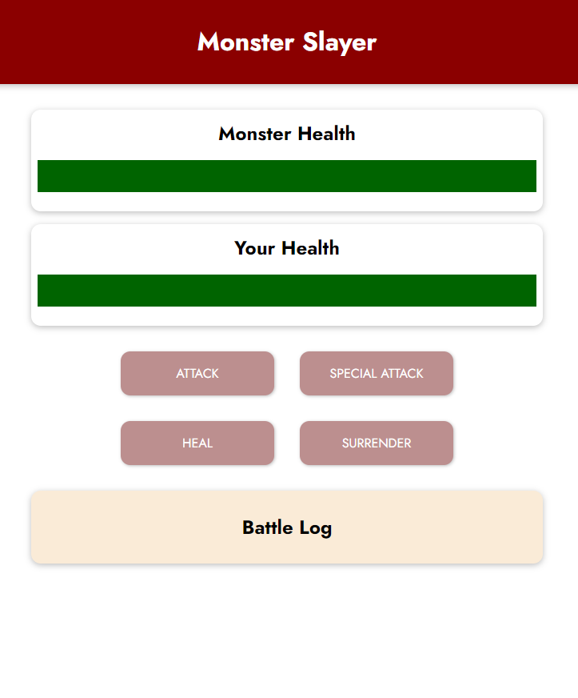

# Monster Slayer v1.0.0

## Index

1. Introduction
2. Installation and usage
3. References

## Introduction

This is a very simple game that was developed as part of a Vue.js course on Udemy by Maximilian Swartzmuller. The course was taken as part of my self improvement when it comes to coding. I am already proficient with React.js and have been curious about Vue for a while now. It seems to be a more efficient way of achieving many of the same end results. Even though it is not industry standard in South Africa, I think I will definitely make use of it when taking on personal projects.  

The objective of creating it was to experiment with and learn the basics of Vue.js.  

## Installation and Usage

There is no need to install anything. The code can be cloned or downloaded from this GitHub repository and run by opening the index.html page in a browser.  

The user interface is very intuitive so I will not go into any detail on its use. The objective of the game is simply to slay the monster before it does so to you.  

## References

Maximillian Swartzmuller, Udemy. Vue - The complete guide.

